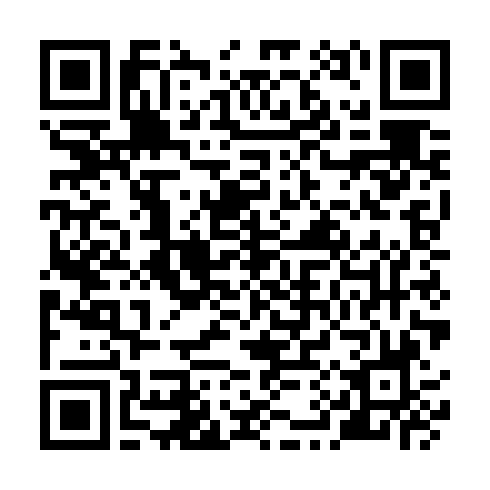

# 📍 Paraty City App

App desenvolvido em React Native para guiar turistas pela cidade de Paraty.

Com ele, a pessoa usuária pode explorar opções de:
- Hospedagens
- Restaurantes
- Passeios

## 🚀 Como executar

Você pode visualizar este projeto em tempo real sem precisar compilar o código localmente.

1. Baixe o **Expo Go** na loja de aplicativos do seu celular.
2. Abra o link de preview do projeto: [AQUI](https://expo.dev/preview/update?message=Subindo+vers%C3%A3o+inicial&updateRuntimeVersion=1.0.0&createdAt=2026-03-28T03%3A42%3A26.299Z&slug=exp&projectId=164fb4b3-421d-4966-8cc4-7e8ccd7a916e&group=0515fefe-ffd7-4c08-92b7-6a3d2643b81b)
3. Escaneie o QR Code exibido na página com a câmera do Expo Go.

## 📷 Escanear QR Code direto

Quem já tiver o Expo Go instalado pode acessar o app imediatamente escaneando a imagem abaixo:

## ✅ Requisitos

- Celular Android ou iOS
- App Expo Go instalado
- Conexão com internet
